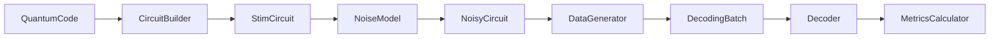

# DecoderInOne 模块化量子纠错解码框架设计文档

**日期**: 2026年05月30日
**状态**: 设计草稿
**作者**: Claude

## 一、项目概述

### 1.1 目标

构建一个模块化的量子纠错解码框架，支持：
- 研究者通过 Python 脚本快速组合实验
- 开发者通过清晰的接口扩展新功能
- 从 Ising-Decoding 迁移核心功能

### 1.2 核心原则

1. **继承体系**: 每个模块下的子类继承自统一抽象基类
2. **分层组织**: 按功能分包，清晰的 import 路径
3. **实验驱动**: 每个实验是一个独立的 Python 脚本
4. **配置灵活**: 参数用 YAML，模块组合用 Python

## 二、整体架构

```
DecodingInOne/
├── decoding_in_one/
│   ├── __init__.py
│   ├── codes/              # 量子纠错码
│   ├── circuits/           # 电路构建
│   ├── noise/              # 噪声模型
│   ├── simulation/         # 数据生成
│   ├── decoders/           # 解码器
│   ├── evaluation/         # 评估指标
│   └── utils/              # 工具函数
├── experiments/           # 实验脚本示例
├── configs/               # YAML 配置文件
└── tests/                 # 单元测试
```

## 三、模块接口设计

### 3.1 codes 模块

**基类**: `QuantumCode`

```python
from abc import ABC, abstractmethod
from typing import List, Dict, Tuple

class QuantumCode(ABC):
    """量子纠错码抽象基类"""
    
    @abstractmethod
    def get_n_physical(self) -> int:
        """返回物理比特数"""
        
    @abstractmethod
    def get_n_logical(self) -> int:
        """返回逻辑比特数"""
        
    @abstractmethod
    def get_stabilizers(self) -> List[PauliString]:
        """返回所有稳定子生成元"""
        
    @abstractmethod
    def get_logical_operators(self) -> Dict[str, PauliString]:
        """返回逻辑算符 {'X': ..., 'Z': ...}"""
        
    @abstractmethod
    def get_qubit_topology(self) -> Dict[int, Tuple[int, int]]:
        """返回比特到坐标的映射（用于可视化）"""
```

**实现类**:
- `SurfaceCode`: 表面码（从 Ising 迁移）
- `QLDPCCode`: QLDPC 码（预留接口）

### 3.2 circuits 模块

**基类**: `CircuitBuilder`

```python
class CircuitBuilder(ABC):
    """量子电路构建器抽象基类"""
    
    @abstractmethod
    def build_stabilizer_measurement(
        self,
        code: QuantumCode,
        stabilizer_type: str,
        stabilizer_idx: int
    ) -> str:
        """构建单个稳定子测量的 Stim 电路片段"""
        
    @abstractmethod
    def build_memory_circuit(
        self,
        code: QuantumCode,
        n_rounds: int,
        measurement_basis: str
    ) -> StimCircuit:
        """构建完整的重复测量电路"""
```

**实现类**:
- `MemoryCircuit`: 表面码重复测量电路（从 Ising 迁移）
- `QLDPC_Circuit`: QLDPC 电路构建器（预留接口）

### 3.3 noise 模块

**基类**: `NoiseModel`

```python
class NoiseModel(ABC):
    """噪声模型抽象基类"""
    
    @abstractmethod
    def apply_to_circuit(self, circuit: StimCircuit) -> StimCircuit:
        """将噪声应用到电路"""
        
    @abstractmethod
    def get_parameters(self) -> Dict[str, float]:
        """返回噪声参数字典"""
        
    @abstractmethod
    def validate(self) -> bool:
        """验证参数有效性"""
        
    @abstractmethod
    def from_config(cls, config_path: str) -> 'NoiseModel':
        """从 YAML 配置文件加载"""
```

**实现类**:
- `CircuitLevelNoise`: 25 参数电路级噪声（从 Ising 迁移）
- `CorrelatedNoise`: 空间相关噪声（预留接口）
- `DistanceAwareNoise`: 距离感知噪声（预留接口）

### 3.4 simulation 模块

**基类**: `DataGenerator`

```python
class DataGenerator(ABC):
    """解码数据生成器抽象基类"""
    
    @abstractmethod
    def generate_batch(
        self,
        batch_size: int,
        seed: Optional[int] = None
    ) -> DecodingBatch:
        """生成一批解码数据"""
        
    @property
    @abstractmethod
    def detector_shape(self) -> Tuple[int, ...]:
        """返回检测器张量形状"""
```

**数据结构**:
```python
@dataclass
class DecodingBatch:
    """解码批次数据"""
    detectors: torch.Tensor           # (batch, n_detectors)
    observables: torch.Tensor         # (batch, n_observables)
    syndrome_grid: Optional[torch.Tensor]  # (batch, n_rounds, d, d)
    metadata: Dict[str, Any]          # 噪声参数、代码参数等
```

**实现类**:
- `StimDataGenerator`: 使用 Stim 采样器
- `TorchDataGenerator`: PyTorch 实现（从 Ising 迁移）

### 3.5 decoders 模块

**基类**: `Decoder`

```python
class Decoder(ABC):
    """解码器抽象基类"""
    
    @abstractmethod
    def decode(
        self,
        syndrome: torch.Tensor,
        observables: Optional[torch.Tensor] = None
    ) -> Correction:
        """
        解码接口
        
        Args:
            syndrome: 检测器测量结果
            observables: 观测量（可选，用于某些解码器）
            
        Returns:
            Correction: 预测的校正或逻辑错误推断
        """
        
    @abstractmethod
    def get_name(self) -> str:
        """返回解码器名称"""
```

**子模块**:
- `decoders.pre`: 预解码器（神经网络）
- `decoders.global`: 全局解码器（经典算法）

**实现类**:
- `NeuralPreDecoder`: 3D CNN 预解码器（从 Ising 迁移）
- `PyMatchingDecoder`: 最小权重完美匹配
- `UnionFindDecoder`: 并查集算法（预留）
- `BeliefPropagationDecoder`: 置信传播（预留）

### 3.6 evaluation 模块

```python
class MetricsCalculator:
    """解码指标计算器"""
    
    @staticmethod
    def logical_error_rate(
        predicted: torch.Tensor,
        actual: torch.Tensor
    ) -> float:
        """计算逻辑错误率"""
        
    @staticmethod
    def syndrome_density_reduction(
        before: torch.Tensor,
        after: torch.Tensor
    ) -> float:
        """计算症状密度减少因子"""
```

## 四、实验脚本示例

```python
# experiments/surface_code_basic.py
import torch
from decoding_in_one.codes import SurfaceCode
from decoding_in_one.noise import CircuitLevelNoise
from decoding_in_one.simulation import StimDataGenerator
from decoding_in_one.decoders import PyMatchingDecoder
from decoding_in_one.evaluation import MetricsCalculator

# 1. 定义码和电路
code = SurfaceCode(distance=7, rotation='O1')

# 2. 配置噪声（从 YAML 加载参数）
noise = CircuitLevelNoise.from_config('configs/noise_25p.yaml')

# 3. 构建电路
builder = MemoryCircuit(code=code, noise=noise)
circuit = builder.build_memory_circuit(n_rounds=7, basis='X')

# 4. 生成数据
generator = StimDataGenerator(circuit=circuit, code=code)
batch = generator.generate_batch(batch_size=10000)

# 5. 解码
decoder = PyMatchingDecoder.from_detector_model(circuit)
corrections = decoder.decode(batch.detectors)

# 6. 评估
ler = MetricsCalculator.logical_error_rate(corrections, batch.observables)
print(f"Logical Error Rate: {ler:.6f}")
```

## 五、配置文件格式

**configs/noise_25p.yaml**:
```yaml
# 25 参数电路级噪声模型
p_prep_X: 0.002
p_prep_Z: 0.002
p_meas_X: 0.002
p_meas_Z: 0.002
p_idle_cnot_X: 0.001
p_idle_cnot_Y: 0.001
p_idle_cnot_Z: 0.001
p_idle_spam_X: 0.001996
p_idle_spam_Y: 0.001996
p_idle_spam_Z: 0.001996
p_cnot_IX: 0.0002
p_cnot_IY: 0.0002
# ... 其余 13 个 CNOT 参数
```

## 六、数据流



## 七、实现优先级

### Phase 1: 核心框架（第 1-2 周）
1. 项目结构和依赖配置（uv）
2. 所有抽象基类定义
3. 基础数据结构（DecodingBatch 等）

### Phase 2: Ising 迁移 - codes & noise（第 3-4 周）
1. SurfaceCode 从 Ising 迁移
2. CircuitLevelNoise 从 Ising 迁移
3. YAML 配置加载

### Phase 3: Ising 迁移 - circuits & simulation（第 5-6 周）
1. MemoryCircuit 从 Ising 迁移
2. StimDataGenerator 基础实现
3. 端到端测试

### Phase 4: Ising 迁移 - decoders & evaluation（第 7-8 周）
1. PyMatchingDecoder 集成
2. MetricsCalculator 实现
3. 完整实验示例

### Phase 5: 扩展接口（后续）
1. QLDPC 相关接口定义
2. 其他解码器接口预留
3. 高级噪声模型接口

## 八、依赖管理

使用 `uv` 管理 Python 依赖：

```toml
# pyproject.toml
[project]
name = "decoding-in-one"
version = "0.1.0"
requires-python = ">=3.11"
dependencies = [
    "stim>=2.0.0",
    "pymatching>=2.0.0",
    "torch>=2.0.0",
    "numpy>=1.24.0",
    "pyyaml>=6.0",
]
```

## 九、版本控制

每个 Phase 完成后提交 git：
- Phase 提交：功能完成，测试通过
- 中间提交：关键功能添加时
- 标记重要版本：v0.1.0, v0.2.0 等
